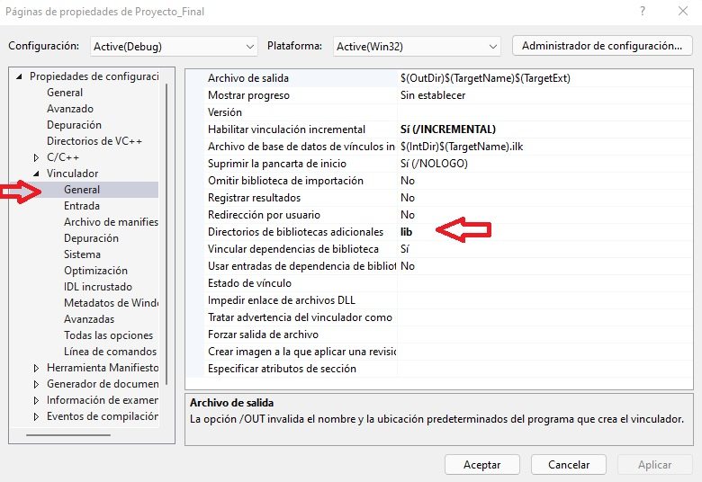
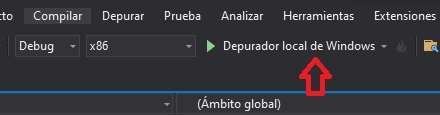
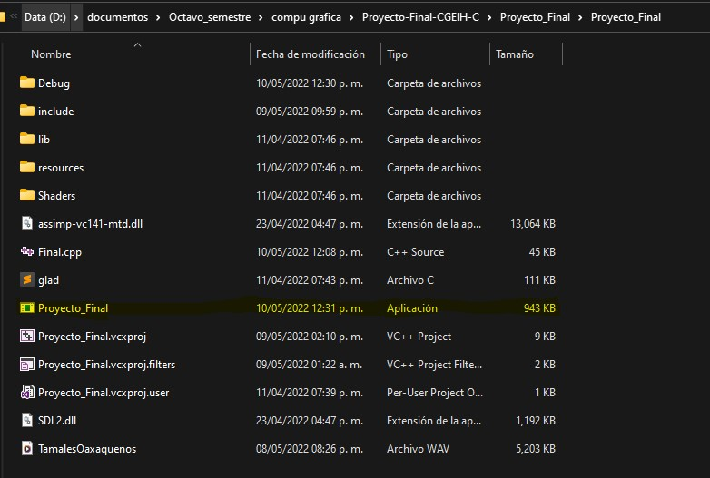
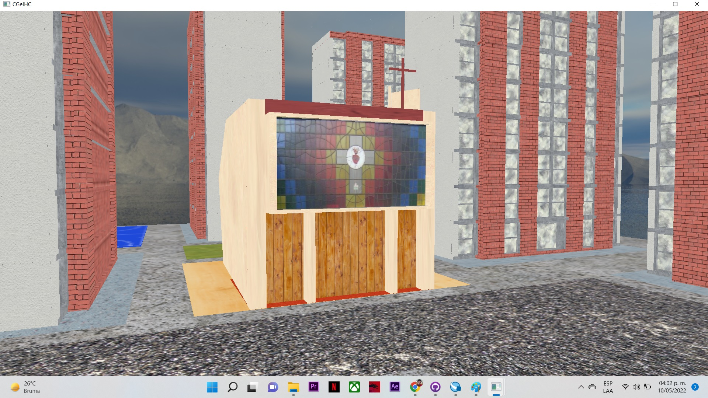
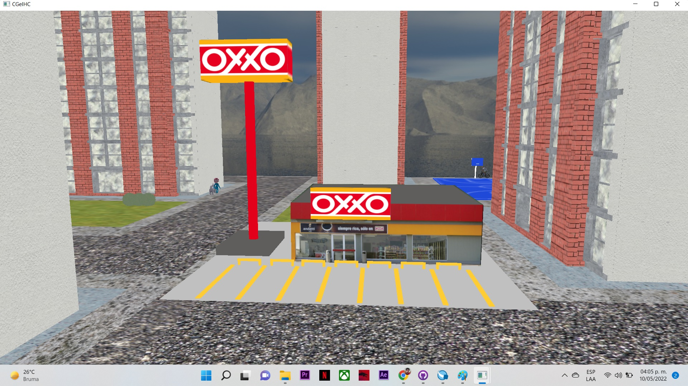

 
# User Manual 📖
 
## Final Project of Computer Graphics and Human-Computer Interaction 👨🏽‍💻

## Student:
 - Maceda Patricio Fernando🤵🏽
 - ID: 316054416
  
### Semester 2022-2 | Class ID 4

### Requirements

* To run with Visual Studio 2019 and C++ installation or with the .exe file:
    - Windows 7, Windows 8, Windows 10
    - Processor: 1.8 GHz (recommended 4 cores or more)
    - 2.5 GB RAM minimum, 8 GB recommended
    - 20 GB free on hard disk
    - Graphic chip of minimum 720p resolution

### Opening and execution

Download the project from GitHub by clicking the green button ("Code") and selecting one of the options

    </img>

 
If you select "Open with GitHub Desktop" you need to have this application installed on your computer and follow the steps to clone the repository locally, once
cloned skip to ["Run the .exe file"](#item1).

"Download ZIP" selection will download a .zip file of the project, unzip it on your computer and skip to ["Run the .exe file"](#item1).
  
 ### Execution with Visual Studio 💻
 
  If you wish and have the Visual Studio IDE installed, you can run the application by following the steps below.
  Have the project downloaded from git-hub and have unzipped the zip folder. Once you have this open Visual Studio and select the option "Open a project or a solution"
 
 

  </img>

 
Find the file "Proyecto_Final.sln" inside the folder and click on the "Open" button.
  
  

  </img>

  
Before executing the program We check that all the libraries and configurations are loaded correctly. We go to the solution explorer, right click on the project name and select the properties option.
 

  </img>

 
In the "General" section we verify that the Platform Toolkit We have downloaded, it can be v142 or v143.
  
 

  </img>

Inside C/C++ -> General check that the keyword **include** is in additional include directories. In Linker -> General check that the keyword **lib** is in Additional Library Directories and finally in Linker -> Input verify that dependencies  **Winmm.lib;SDL2.lib;SDL2main.lib;assimp-vc141-mtd.lib;opengl32.lib;glfw3.lib;kernel32.lib;user32.lib;gdi32.lib;winspool.lib;comdlg32.lib;advapi32.lib;shell32.lib;ole32.lib;oleaut32.lib;uuid.lib;odbc32.lib;odbccp32.lib;%(AdditionalDependencies)** are included in Additional Dependencies. 
 
 

  </img>

 
 

  </img>

 
 

  </img>

  
To run the project, you must select the "x86" option in the upper bar and verify that the "Debug" option is selected, as in the following image:
 
 

  </img>

 
You can now run the project by clicking on the "Local Windows Debugger" button, this button opens the program window.
  
  

  </img>

 
 
 ### Run the .exe file 🚀
  
Once the project has been cloned or the ZIP has been unzipped: open the generated folder or repository location on your computer and go to ".\Proyecto_Final\Proyecto_Final", locate the file "Proyecto_Final.exe" and double-click to open. This will open a window with the virtual space running.
  
  

  </img>

 
### Interaction with the environment ⛺️

With the window open; being inside the virtual space we can move the camera with the mouse. The interaction occurs through the keyboard and mouse of the computer.
  

</img>

  
Model of the Church and its location⛪.
 

</img>

 Model of the Oxxo Store and its location 🏪.
 

</img>

 Location of the rooms on the map. Go to this building to be able to observe the furniture and animations 🏬. 
  

</img>

 First room 🏠.
  

</img>

 Second room 🏠.
  

</img>

  
#### Functions
* Keyboard:
    * "Esc" : to exit the window / finish the program. ❌
    
    Simulation of forward ⬆️, backward ⬇️, left ⬅️, right ➡️ keys for movement as it happens in video games
    * "W" : move the camera forward ⬆️. 
    * "S" : move the camera backward ⬇️. 
    * "A" : move the camera to the left  ⬅️.
    * "D" : move the camera to the right ➡️.
    
    Music:
    * "Z" : Start the music :notes:.
 
    Animations:
 
    * "SPACE" : turn car animation on or off 🚗.
    

      </img>
    

     
    * "1"     : activate the animation of the person walking 🚶‍♂️. 
     
    

      </img>
    

     
    * The tricycle animation does not need user input 🚲.
     
    

      </img>
    

     
    * The bicycle animation does not need user input 🚴‍♂️.
     
    

      </img>
    

     
    * The animation of the person walking with the dog does not need user input 🚶‍♀️🐕.
     
    

      </img>
    

     
    * The athlete animation does not require user input ⛹️‍♂️.
     
    

      </img>
    

          
    * The chair animation does not need user input. 🪑.
     
    

      </img>
    

          
    * The refrigerator animation does not need user input. 🧊.
     
    

      </img>
    

          
    * Fan animation does not need user input 💨. 
     
    

      </img>
    

    
* Mouse movements:
    * Mouse swipe 🔁 left or right, up or down rotates the camera 📷 in that swipe direction, the field of view 🔍 moves like a computer cursor.
    * Mouse scroll zoom + 🔍 moving it forward and zoom - 🔍 backward.
