

# Proyecto Final Laboratorio de Computación Gráfica E Interacción Humano-Computadora 👨🏽‍💻

## Integrantes:
 - Maceda Patricio Fernando🤵🏽
 - Cta: 316054416
 - Reyes Avila David 🤵🏽
 - Cta: 316184979
 - Salinas Romero Daniel 🤵🏽
 - Cta: 419049300
 - Vaquero Barajas Alexis 🤵🏽
 - Cta: 316073934
  
### Semestre 2022-2 | Grupo 2

### Requerimentos

* Para ejecución con Visual Studio 2019 con instalación de C++ o con el ejecutable .exe:
    - Windows 7 (Última actualización), Windows 8 (2919355), Windows 10 (version 1703 o superior)
    - Procesador: 1.8 GHz (recomendado 4 núcleos o más)
    - 2.5 GB RAM mínimo, 8 GB recomendado
    - 20 GB en disco, recomendado
    - Chip gráfico de mínimo 720p de resolución

### Apertura y ejecución del proyecto

Descargar el proyecto desde GitHub dando click al boton verde "Code" y seleccionando una de las opciones

    </img>

 
Si selecciona "Open with GitHub Desktop" requiere tener esta aplicación instalada en su equipo y seguir los pasos para clonar el repositorio de manera local, una vez 
clonado saltar hasta ["Ejecución el archivo .exe"](#item1).

La selección "Download ZIP" descargará un archivo .zip del proyecto, habrá que descomprimirlo en su equipo, regresar a este manual y saltarse hasta ["Ejecución el archivo .exe"](#item1).

 ### Ejecución con Visual Studio 💻
 
 Si se desea y tiene instalado el IDE Visual Studio puede ejecutar la aplicación siguiendo los siguientes pasos.
 Tener descargado el proyecto de git-hub y haber descomprimdo la carpeta zip. Una vez teniendo esto abrir Visual Studio y seleccionar la opción "Abrir un proyecto o una solución"
 
 

  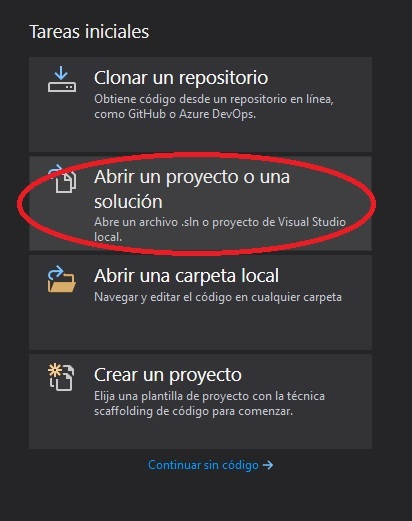</img>

 
 Buscar el archivo "Proyecto_Final.sln" dentro de la carpeta descomprimida y dar en el botón de abrir. 

  

  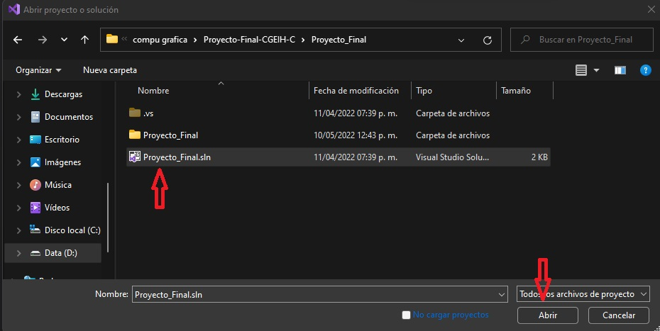</img>

 
Antes de ejectutar el programa comprobamos que todas las bibliotecas y configuraciones esten cargadas correctamente. Nos dirigimos al explorador de soluciones, hacemos click derecho en el nombre del proyecto y seleccionamos la opción de propiedades.
 

  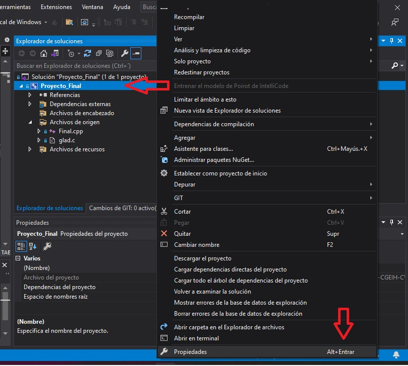</img>

 
 En el apartado de "General" verificamos que el Conjunto de herramienras de la plataforma sea uno que tengamos descargado puede ser v142 o v143.
 
 

  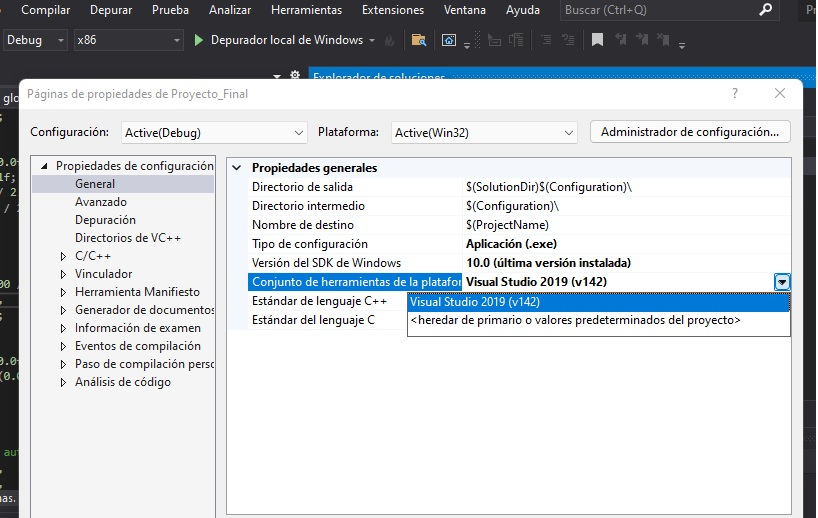</img>

 
Dentro de C/C++ -> Gneral verificar que la palabra **include** se encuentra en directorios de inclusión adicionales. En el Vincluador -> General la palabra **lib** en Directorios de bibliotecas adicionales y finalmente, en Vinculador -> Entrada verificar que las dependencias **Winmm.lib;SDL2.lib;SDL2main.lib;assimp-vc141-mtd.lib;opengl32.lib;glfw3.lib;kernel32.lib;user32.lib;gdi32.lib;winspool.lib;comdlg32.lib;advapi32.lib;shell32.lib;ole32.lib;oleaut32.lib;uuid.lib;odbc32.lib;odbccp32.lib;%(AdditionalDependencies)** esten incluidas en Dependencias adicionales. 
 
 

  </img>

 
 

  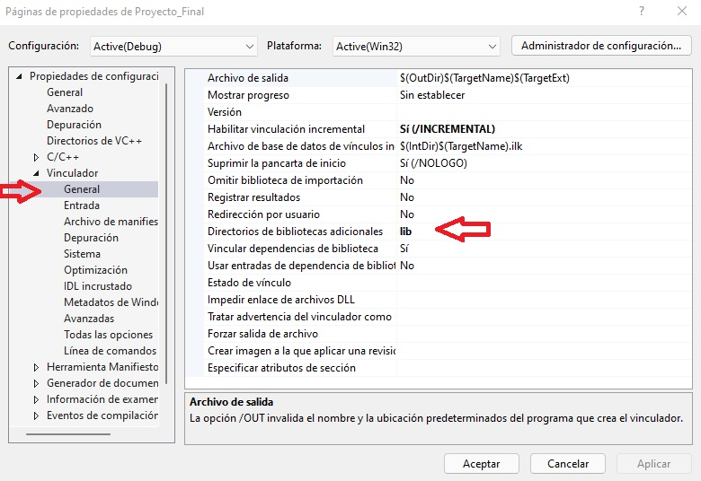</img>

 
 

  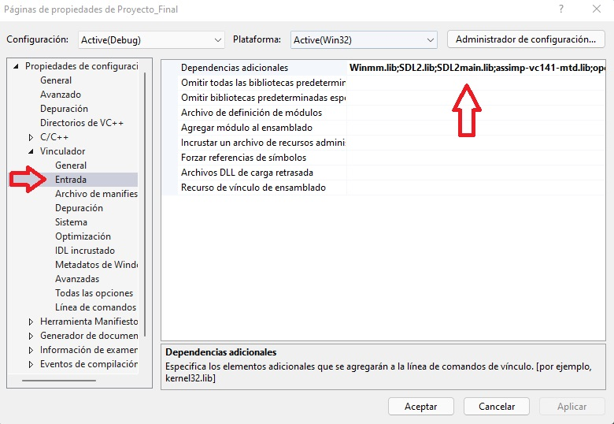</img>

 
 Para poner en ejecución el proyecto se debe seleccionar la opción "x86" en la barra superior y verificar que esté seleccionada la opción "Debug" como se muestra en la siguiente imagen.
 
 

  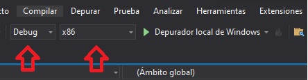</img>

 
 Ya puede ejecutarse el proyecto dando click en el boton "Depurador local de Windows", esto abrirá la ventana del programa.
 
  

  </img>

 
 
 ### Ejecución con archivo .exe 🚀

Una vez clonado el proyecto o descomprimido el ZIP: abrir la carpeta generada o ubicación del repositorio en su equipo y dirigirse a ".\Proyecto_Final\Proyecto_Final", ubicar el archivo "Proyecto_Final.exe" y dar doble click para abir. Lo anterior abrirá una ventana con el espacio virtual ejecutandose.

  </img>

 
### Interacción con el ambiente ⛺️

Una vez abierta la ventana; estando dentro del espacio virtual se captura el mouse para funcionar unicamente dentro de este, por lo que no se observa el cursos y el movimiento del mouse solo funciona dentro de la ventana. La interacción se da mediante el teclado y mouse de la computadora.

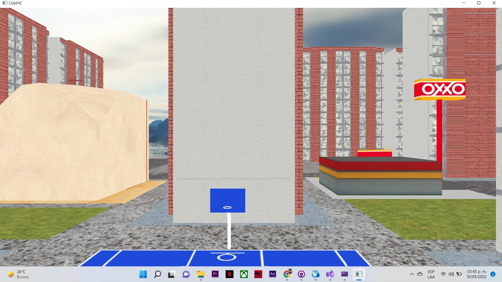</img>

 Modelo de la Iglesia y su ubicación
 

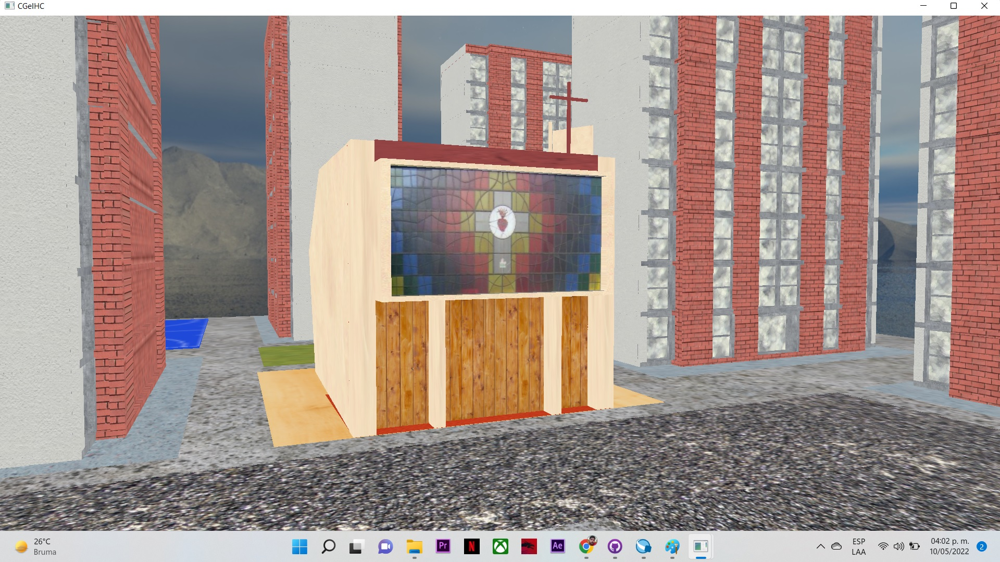</img>

 Modelo de la tienda Oxxo y su ubicación
 

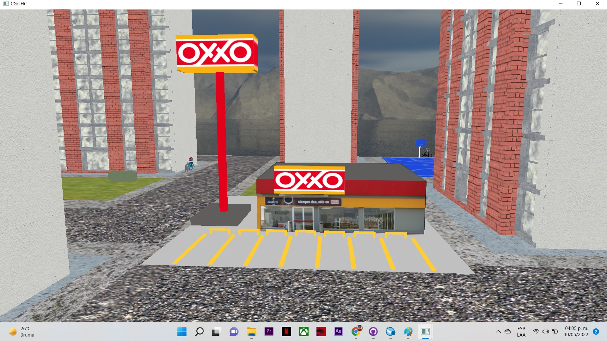</img>

 
 
#### Funciones
* Teclado:
    * "Esc" : para salir de la ventana / terminar el programa. ❌
    
    Simulación de las teclas de adelante ⬆️, atrás ⬇️, izquierda ⬅️, derecha ➡️ para movimiento como sucede en los videojuegos
    * "W" : mover la cámara hacia enfrente ⬆️. 
    * "S" : mover la cámara hacia atrás ⬇️. 
    * "A" : mover la cámara hacia la izquierda ⬅️.
    * "D" : mover la cámara hacia la derecha ➡️.
    
    Musica:
    * "Z" : incia la música :notes:.
 
    Animaciones:
 
    * "SPACE" : activar o desactivar la animacion del vehiculo 🚗.
    

      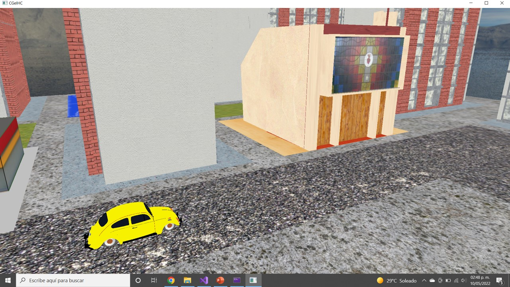</img>
    

     
    * "1"     : activar la animación de la persona que camina 🚶‍♂️. 
     
    

      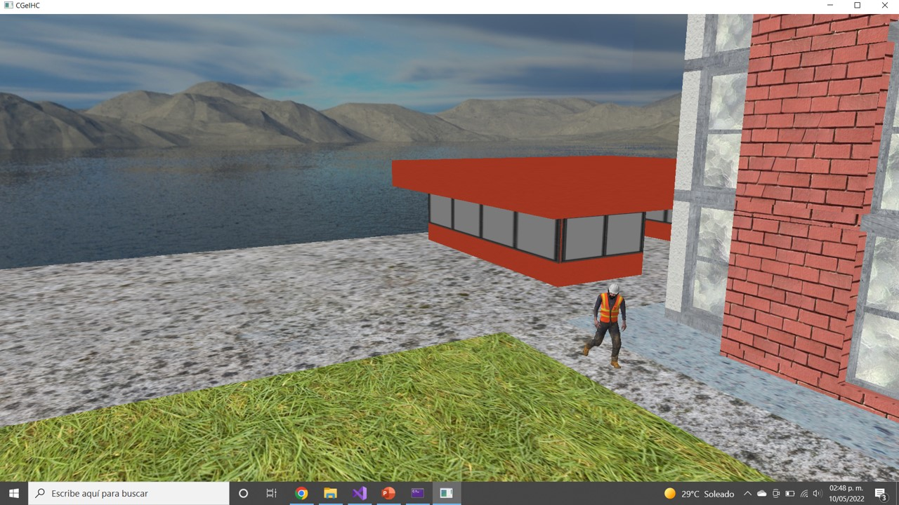</img>
    

     
    * La animacion del triciclo no necesita una entrada del usuario 🚲.
     
    

      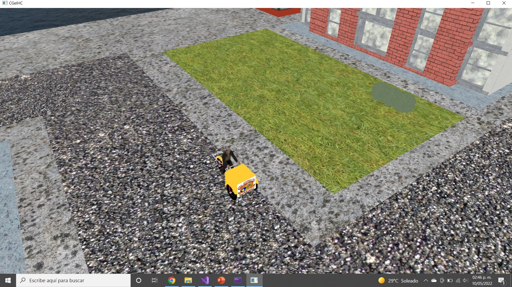</img>
    

     
    * La animacion de la bicicleta no necesita una entrada del usuario 🚴‍♂️.
     
    

      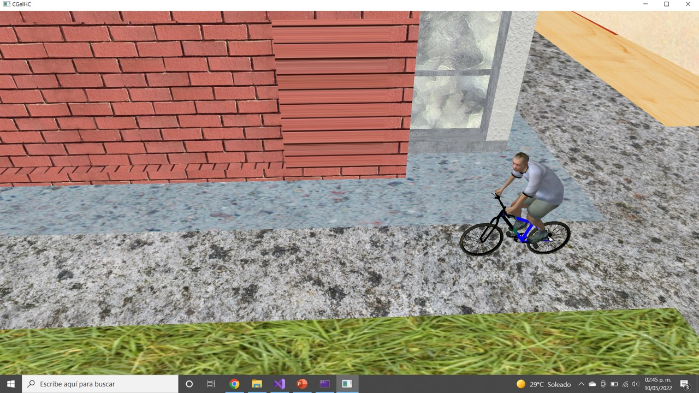</img>
    

     
    * La animacion de la persona paseando no necesita una entrada del usuario 🚶‍♀️🐕.
     
    

      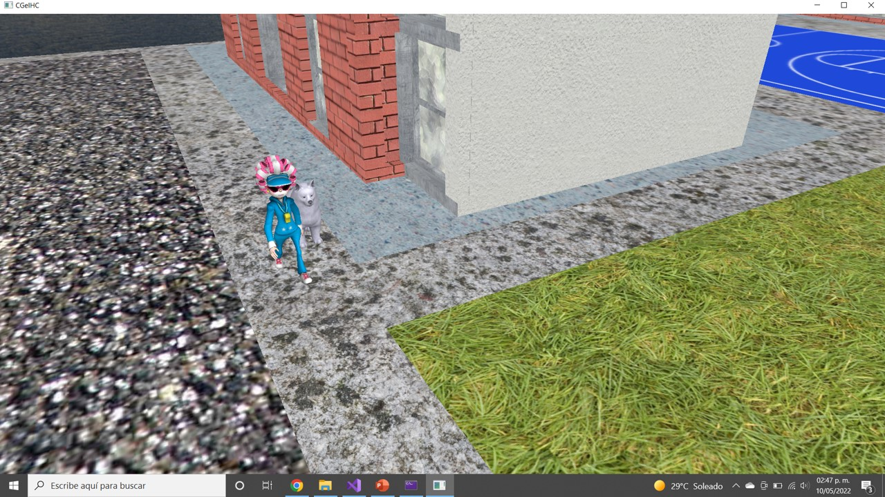</img>
    

     
    * La animacion del deportista no necesita una entrada del usuario ⛹️‍♂️.
     
    

      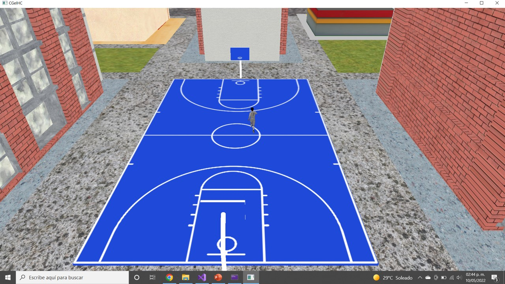</img>
    

    
* Movimientos del mouse:
    * El deslizamiento del mouse 🔁 a la izquierda o derecha, arriba o abajo realiza el giro de la cámara 📷 en dicha dirección de deslizado, el field of view 🔍 se mueve como sucede con el cursor de la computadora.
    * Scroll del mouse reliza zoom + 🔍 moviéndolo hacia enfrente y zoom - 🔍 hacia atrás. 
